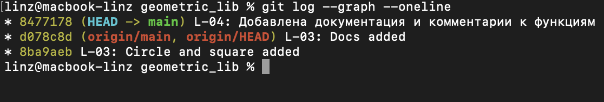

# Geometric Lib

## Общее описание решения
Библиотека **Geometric Lib** содержит функции для решения базовых геометрических задач: вычисления площади и периметра круга и квадрата. Проект написан на языке Python.

# Math formulas
## Area
- Circle: S = πR²
- Rectangle: S = ab
- Square: S = a²

## Perimeter
- Circle: P = 2πR
- Rectangle: P = 2a + 2b
- Square: P = 4a

---

## Описание функций с примерами вызова

### 1. `circle.py`
Модуль для работы с кругом и окружностью.

- **`area(r)`**
  - **Описание:** Вычисляет площадь круга по его радиусу $r$.
  - **Параметры:** `r` (`float`) — радиус круга.
  - **Возвращаемое значение:** `float` — площадь круга.
  - **Пример вызова:**
    ```python
    import circle
    print(circle.area(5))  # 78.53981633974483
    ```

- **`perimeter(r)`**
  - **Описание:** Вычисляет длину окружности по радиусу $r$.
  - **Параметры:** `r` (`float`) — радиус круга.
  - **Возвращаемое значение:** `float` - длина окружности.
  - **Пример вызова:**
    ```python
    import circle
    print(circle.perimeter(5))  # 31.41592653589793
    ```

---

### 2. `square.py`
Модуль для работы с квадратом.

- **`area(a)`**
  - **Описание:** Вычисляет площадь квадрата по длине стороны $a$.
  - **Параметры:** `a` (`float`) - длина стороны квадрата.
  - **Возвращаемое значение:** `float` - площадь квадрата.
  - **Пример вызова:**
    ```python
    import square
    print(square.area(4))  # 16
    ```

- **`perimeter(a)`**
  - **Описание:** Вычисляет периметр квадрата по длине стороны $a$.
  - **Параметры:** `a` (`float`) - длина стороны квадрата.
  - **Возвращаемое значение:** `float` - периметр квадрата.
  - **Пример вызова:**
    ```python
    import square
    print(square.perimeter(4))  # 16
    ```


### 3. `rectangle.py`
Модуль для работы с прямоугольником.

- **`area(a, b)`**
  - **Описание:** Вычисляет площадь прямоугольника по двум сторонам $a$ и $b$.
  - **Параметры:**
  - `a` (`float`) - длина первой стороны
  - `b` (`float`) - длина второй стороны.
  - **Возвращаемое значение:** `float` - площадь прямоугольника.
  - **Пример вызова:**
    ```python
    import rectangle
    print(rectangle.area(3, 5))  # 15
    ```

- **`perimeter(a, b)`**
  - **Описание:** Вычисляет периметр прямоугольника по двум сторонам $a$ и $b$.
  - **Параметры:**
  - `a` (`float`) - длина первой стороны
  - `b` (`float`) - длина второй стороны.
  - **Возвращаемое значение:** `float`— периметр прямоугольника.
  - **Пример вызова:**
    ```python
    import rectangle
    print(rectangle.perimeter(3, 5))  # 16
    ```

### 4. `triangle.py`
Модуль для работы с треугольником.

- **`area(a, h)`**
  - **Описание:** Вычисляет площадь треугольника по основанию $a$ и высоте $h$.
  - **Параметры:**
  - `a` (`float`) - длина основания треугольника
  - `h` (`float`) - высота треугольника.
  - **Возвращаемое значение:** `float` - площадь треугольника.
  - **Пример вызова:**
    ```python
    import triangle
    print(triangle.area(6, 4))  # 12.0
    ```

- **`perimeter(a, b, c)`**
  - **Описание:** Вычисляет периметр треугольника по длинам трех сторон $a$, $b$, $c$.
  - **Параметры:**
  - `a` (`float`) - длина первой стороны
  - `b` (`float`) — длина второй стороны
  - `c` (`float`) -длина третьей стороны.
  - **Возвращаемое значение:** `float` - периметр треугольника.
  - **Пример вызова:**
    ```python
    import triangle
    print(triangle.perimeter(3, 4, 5))  # 12
    ```



